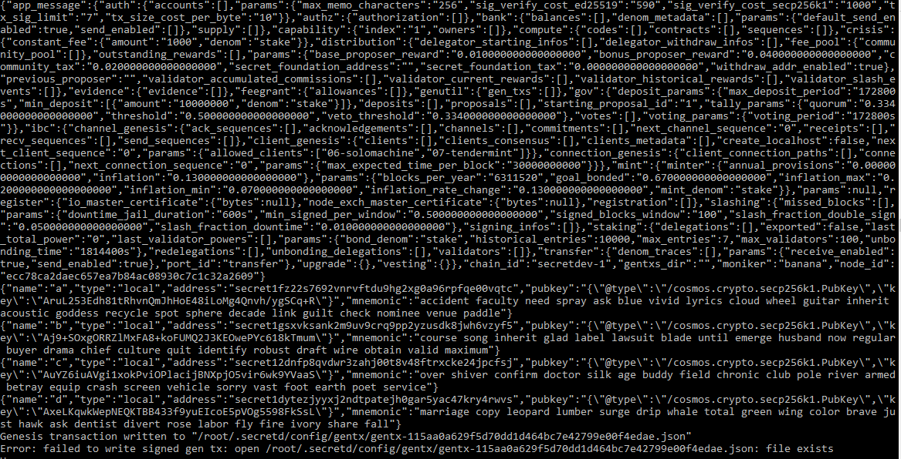

# Tutorial: Launching a Local Developer Secret Network Blockchain

This tutorial is for developers to get started with development on the Secret Network. The local blockchain 
runs in a docker container and simulates the Intel SGX (TEE) that is a requirement for the Holodeck testnet and 
mainnet.

It's super easy and quick, once you have `docker` installed. Just a few commands!

## Setup Your Environment

*NOTE*: These instructions were written using Linux as the environment. The JSON processor `jq` may not be available for Windows.
For Windows omit the `| jq` where it's been used below.

- Install [Docker](https://docs.docker.com/install/) for your environment (Mac, Windows, Linux).

- Install [JQ](https://github.com/stedolan/jq/releases), command-line JSON processor, for your environment (Mac, Windows, Linux).

- Pull the Secret developer testnet image from Docker Hub.

```bash
docker pull enigmampc/secret-network-sw-dev
```

## Launch the Developer Secret Network

In a terminal window start the Secret Network by running the docker container named _secretdev_:

```bash
docker run -it --rm -p 26657:26657 -p 26656:26656 -p 1337:1337 -v $(pwd):/root/code --name secretdev enigmampc/secret-network-sw-dev
```

*NOTE*: To stop the _secretdev_ blockchain enter `ctrl + c`.

Your local blockchain starts with a set of keys or accounts, named `a`, `b`, `c`, and `d`.



After initializing and validating the genesis file you can see the network starting and blocks getting committed. 
Included in the startup is an HTTP REST server (also known as the LCD or Light Client Daemon) that can be accessed 
via `localhost` on port *1337*.

## Query the Latest Block


Use the REST API to view the latest block information.

```bash
curl http://localhost:1337/blocks/latest | jq
```


## Use the CLI to Interact with the Network

In a separate terminal window connect to the container in interactive mode, executing the Bash shell.

```bash
docker exec -it secretdev /bin/bash
```

Query the list of keys using `secretd`:

```bash
secretd keys list | jq
```

*NOTE*: _secretd_ is configured to use the test keyring backend which makes it easier for development and
testing (e.g. no password required).


Query the account balance of one of the keys:

```bash
secretd q bank balances secret1fz22s7692vnrvftdu9hg2xg0a96rpfqe00vqtc
```


Use `exit` to quit your interactive Docker session.

## Secret Resources for Developers

- [Secret Overview](https://docs.scrt.network/overview.html)
- [Secret Architecture](https://docs.scrt.network/protocol/architecture.html)
- [Secret Protocol](https://docs.scrt.network/protocol/intro.html)
- [Secret Light Client](https://docs.scrt.network/cli/secretcli.html)

