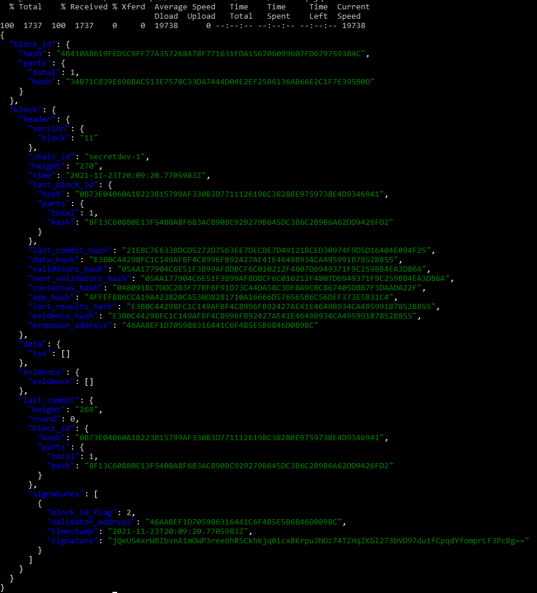

# Tutorial: Launching a Local Developer Secret Network Blockchain

This tutorial is for developers to get started with development on the Secret Network. The local blockchain 
runs in a docker container and simulates the Intel SGX (TEE) that is a requirement for the Holodeck testnet and 
mainnet.

It's super easy and quick, once you have `docker` installed. Just a few commands!

## Setup Your Environment

- Install [Docker](https://docs.docker.com/install/) for your environment (Mac, Windows, Linux).

## Launch the Developer Secret Network

In a terminal window start the Secret Network by running the docker container named _secretdev_:

```bash
docker run -it --rm \
  -p 26657:26657 -p 26656:26656 -p 1337:1337 \
  --name secretdev enigmampc/secret-network-sw-dev
```

*NOTE*: To stop the _secretdev_ blockchain enter `ctrl + c`.

Your local blockchain starts with a set of keys or accounts, named `a`, `b`, `c`, and `d`.


After initializing and validating the genesis file you can see the network starting and blocks getting committed. 
Included in the startup is an HTTP REST server that can be accessed via `localhost` on port *1337*.


To check out the LCD (light client daemon) use the `curl` command to view the latest block.

```bash
curl http://localhost:1337/blocks/latest
```



## Use the CLI to Interact 

In a separate terminal window connect to the container in interactive mode, executing the Bash shell.

```bash
docker exec -it secretdev /bin/bash
```

Query the list of keys using `secretcli`:

```bash
secretcli keys list
```

*NOTE*: _secretcli_ is configured to use the test keyring backend which makes it easier for development and
testing (e.g. no password required).


## More Cool Stuff

- [Secret Network Overview](https://build.scrt.network/overview.html)
- [Secret Network Architecture](https://build.scrt.network/protocol/architecture.html)
- [Secret Network Protocol](https://build.scrt.network/protocol/intro.html)
- [Using the _secretcli_ light client](https://github.com/enigmampc/SecretNetwork/blob/master/docs/validators-and-full-nodes/secretcli.md)

